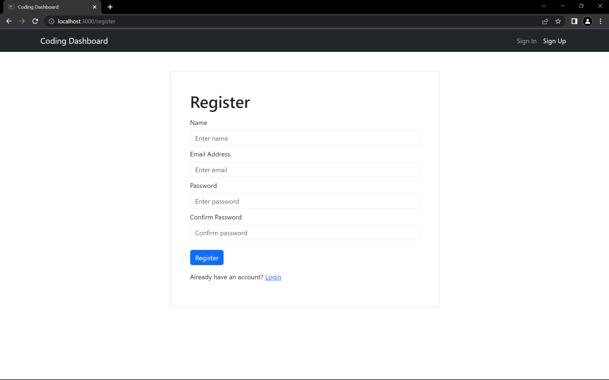

# Coding Dashboard

This i a MERN stack application with authentication. This is for a SPA (Single Page Application) workflow that uses the [Vite](https://vite.dev) Build tool

  
The title of the image group

  
  
  

